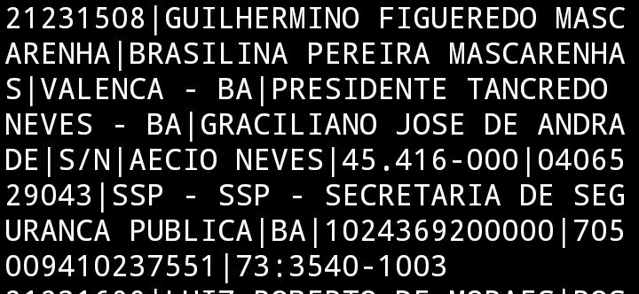

# datasus
Banco de dados datasus

# Informações pessoais
| Campo | Descrição |
| --- | --- |
| CPF | Número de Cadastro de Pessoa Física |
| Nome | Nome completo da pessoa |
| Data de nascimento | Data de nascimento da pessoa |
| Sexo | Gênero da pessoa |
| Bairro | Bairro de residência |
| CEP | Código de Endereçamento Postal |
| Data emissão | Data de emissão do documento |
| Logradouro | Endereço completo |
| Município | Cidade de residência |
| Município de nascimento | Cidade de nascimento |
| Nome da mãe | Nome da mãe da pessoa |
| Nome do pai | Nome do pai da pessoa |
| Número da casa | Número da residência |
| Orgão emissor | Órgão responsável pela emissão do documento |
| RG | Registro Geral |
| UF Orgão | Unidade Federativa do órgão emissor |
| CNS | Cartão Nacional de Saúde |
| Telefone | Número de telefone |
# Sobre o arquivo
* Quantidade de linhas: 180 milhões de registros
* Tamanho: 40GB
* Ano de extração: 2021
